  

<picture>
  <source
    srcset="./profile/stats-dark.svg"
    media="(prefers-color-scheme: dark), (prefers-color-scheme: no-preference)"
  />
  <source
    srcset="./profile/stats-light.svg"
    media="(prefers-color-scheme: light)"
  />
  
</picture>

### 👋 手を振る / :wave:

あわわわとーにゅです。

* ~ 2024-10-06 まっちゃとーにゅ
* ~ 2020-06-17 サツキ

### 📫 わたしへの連絡方法 / How to reach me
プロジェクトやIssueに関する連絡はそのIssueに書いて下さい。
* Fediverse: [@u1_liquid@misskey.io](https://misskey.io/@u1_liquid)  
* Discord: [@awasoymilk](https://discord.com/users/296564579536863232)  

### ⚡ 実は / In fact
* 一人称として「私」を使っているわたしは偽物の可能性があります。ご注意ください。
* 日本語 / 韓国語 / C# / Java / Bash / Scala / TypeScript / Kotlin / 英語 の読み書きができます。
* WebフロントエンドフレームワークはVue.jsよりReactの方が好きです。仕事ではReactしか使いません。
* バックエンドエンジニアなのでフロントエンドは必要最低限のことしかできません。CSSなんもわからん
* なんでもRustで再実装することが正義だと思っている人たちが凄く嫌いでRustも嫌いです。

<picture>
  <source
    srcset="https://wakatime.com/share/@u1_liquid/1b927703-3c4f-42c8-990f-cf04eb4f4384.svg"
    media="(prefers-color-scheme: dark), (prefers-color-scheme: no-preference)"
  />
  <source
    srcset="https://wakatime.com/share/@u1_liquid/57de673b-0f2d-4dd9-9d89-ba284a71aaf3.svg"
    media="(prefers-color-scheme: light)"
  />
  
</picture>
